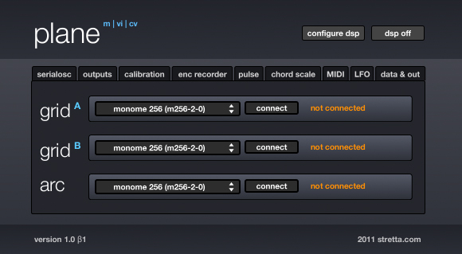

# plane m vi cv

scrolling monophonic diatonic step sequencer with MIDI and CV outputs

created by: stretta

plane m | vi | cv is a monophonic diatonic step sequencer. Scale degrees, not notes are presented on the monome grid, which are then passed through a diatonic transposition mechanism which can be altered and transposed in real time. If you're looking for a chromatic or polyphonic step sequencer, please see plane p.

requires a monome grid (any size)
arc is optional (scrolling via mouse, keyboard or powermate is supported)

warning: plane relies exclusively on led/col messages to light the grid. monome emulators (arduinome, launchpad) may not work, or, at best, produce extremely sluggish scrolling response due to how the monome firmware is optimized to deal with this message. 

## Installation

move

	sigmund~.mxo
	sigmund~.maxhelp

to

	max 5/cycling '74/max-externals

http://www.youtube.com/OfFyvh_BGN8

The current version of Plane is now maintained as part of Beap:

http://github.com/stretta/BEAP